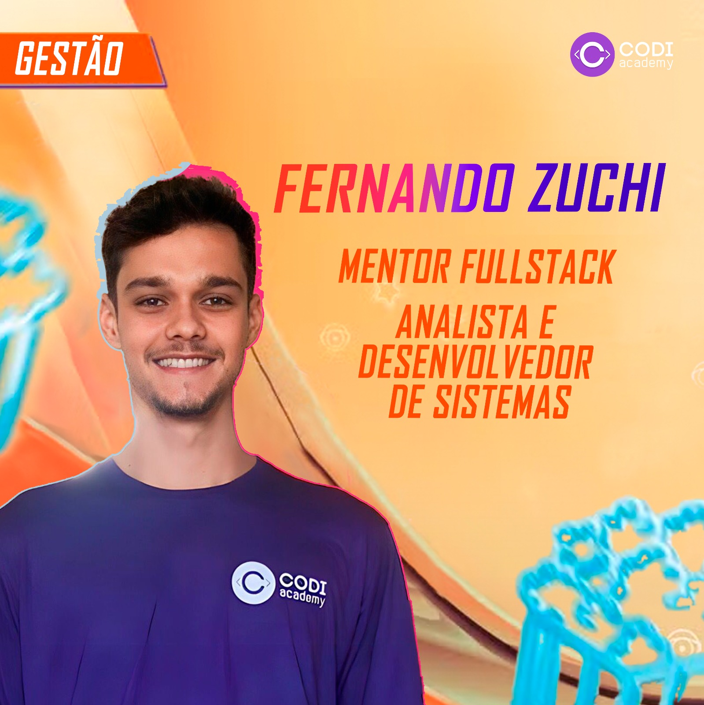

&nbsp;&nbsp;&nbsp;

Estou práticando a resolução de problemas usando a tecnologia.    Tanto no Front-End quanto no Back-End, Eu sou <strong>apaixonado em aprender coisas novas</strong> e usá-las para desenvolver projetos e criar soluções. Hoje, eu sou <strong>Mentor FullStack</strong> na Codi Academy, uma escola focada em formar programadores, também atuo na área da programação na empresa, focado em Web-Design e desenvolvimento de software para empresas parceiras.
&nbsp;

 

 
 &nbsp;
 &nbsp;

## My Skills

#### Habilidades Principais:

&nbsp;
&nbsp;
&nbsp;
&nbsp;
&nbsp;
&nbsp;
&nbsp;
&nbsp;
&nbsp;

#### Habilidades Secundárias:

&nbsp;
&nbsp;
&nbsp;
&nbsp;

#### Bancos de Dados:

&nbsp;
&nbsp;
&nbsp;

#### Estudando nesse momento:

Estou no 2° período da faculdade de Análise e Desenvolvimento de Sistemas.

#### Ferramentas de trabalho:

)&nbsp;
&nbsp;

&nbsp;
&nbsp;

## Contato:

 

 

&nbsp;&nbsp;
 

  
  

&nbsp;
